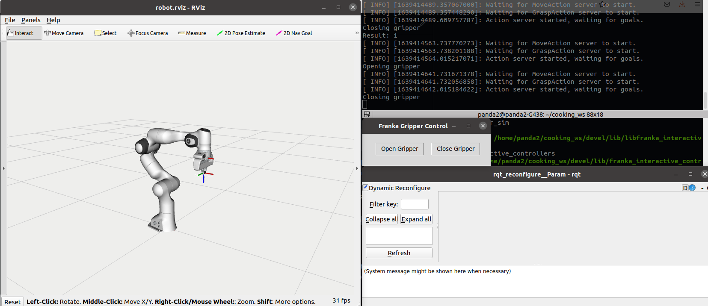
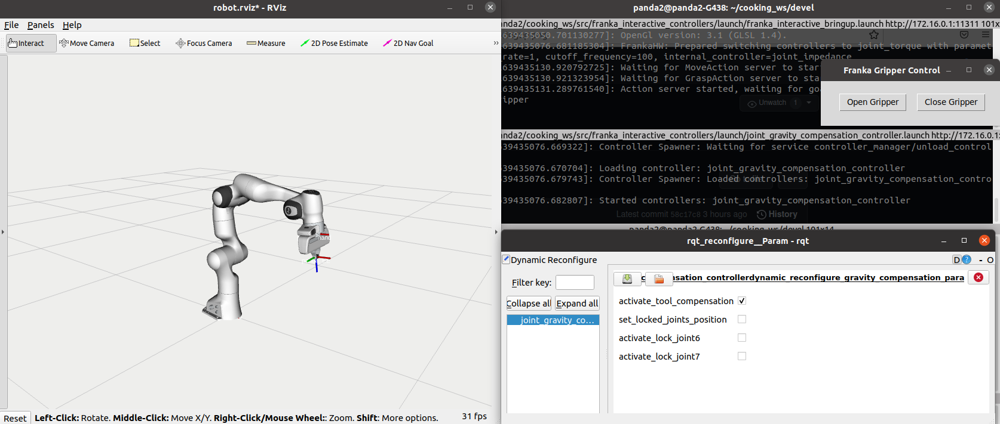
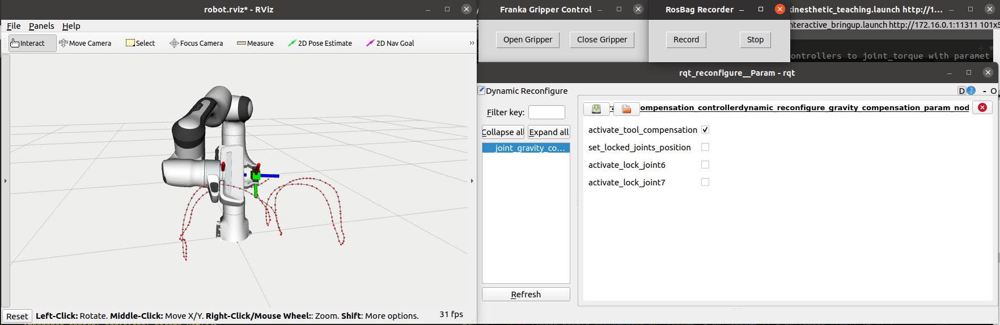

# franka_interactive_controllers

Control interface built on top of [franka_ros](https://frankaemika.github.io/docs/franka_ros.html) that allows to control the franka robot arm in several joint and Cartesian space impedance control schemes for interactive, safe and reactive (mostly DS-based) motion planning and learning. This low-level control interface is used and developed by/for [Prof. Nadia Figueroa](https://github.com/nbfigueroa) and her collaborators and students. Initially developed at MIT in the [Interactive Robotics Group](https://interactive.mit.edu/).

---
## Installation
This package depends on several other code repositories that are robot-agnostic. To install this repo and all its dependencies do the following steps:
* In your catkin src directory clone the repository
```
$ git clone https://github.com/nbfigueroa/franka_interactive_controllers.git
```
* wstool gets all other git repository dependencies, after the following steps you should see extra catkin 
  packages in your src directory.
```
$  wstool init
$  wstool merge franka_interactive_controllers/dependencies.rosinstall 
$  wstool up 
```
* Query and installs all libraries and packages 
```
$ rosdep install --from-paths . --ignore-src --rosdistro <your-ros-distro> 
```

* Finally complie
```bash
  $ cd ~/catkin_ws
  $ catkin_make
  $ source devel/setup.bash
  $ catkin_make
  $ rospack profile
```
 You might need to source the `./bashrc` file and compile again if the first compliation could not find some of the in-house dependencies. If `roscd` doesn't find the compiled packages run `rospack profile`.

---
## Usage
**[ROBOT LAUNCH]**   
- To bring up the standalone robot with [franka_ros](https://frankaemika.github.io/docs/franka_ros.html) (useful for testing -- can be included in your custom launch file):
  ```bash
  roslaunch franka_interactive_controllers franka_interactive_bringup.launch 
  ```
  This will load franka_control functionalities + gripper GUI controller + configured rviz settings.
  <p align="center">
     
  </p>

**[ROBOT CONTROLLERS]** 
- To load the [joint gravity compensation controller](https://github.com/nbfigueroa/franka_interactive_controllers/blob/main/src/franka_joint_controllers/joint_gravity_compensation_controller.cpp) launch the following:
  ```bash
  roslaunch franka_interactive_controllers joint_gravity_compensation_controller.launch
  ```
    - This will load a joint gravity compensation torque controller. It compensates (from code) the weight of any additional tool (i.e., a tool grasped by the hand or cameras mounted on the gripper). As well as the capability to lock certain joints for ease of demonstration. 
    - The external forces imposed on the end-effector with the additional weight should be defined in ``./config/external_tool_compensation.yaml``. Instructions on how to finding values for your custom tool [here](https://github.com/nbfigueroa/franka_interactive_controllers/blob/main/doc/instructions/external_tool_compensation.md). You can toggle to **activate/deactivate** this compensation online using dynamic reconfigure. Default is set to ``true``.
    - The desired joints to lock and the locked positions can be modified online by dynamic reconfigure. Default is set to ``false`` for all locks.
    - To launch ``franka_interactive_bringup.launch`` within this same launch file ``set load_franka_control:=true``. Default is set to ``false``.
    <p align="center">
         
    </p>
    - If you run this script and the robot moves by itself, that means that your external_tool_compensation forces are incorrect. See instructions [here](https://github.com/nbfigueroa/franka_interactive_controllers/blob/main/doc/instructions/external_tool_compensation.md) to correct it. 
    
- To load a cartesian impedance controller with pose command, launcg the following:
  ```bash
  roslaunch franka_interactive_controllers cartesian_pose_impedance_controller.launch
  ```

- To move robot to desired joint configuration (q_goal) with a motion generator and joint impedance control:
  ```bash
  roslaunch franka_interactive_controllers joint_goal_impedance_controller.launch
  ```
  
**[GRIPPER CONTROL]**  
This repo includes a ros-nodified version of  [franka_gripper_run](https://github.com/nbfigueroa/franka_gripper_run) that uses the actionlib server from [franka_ros/franka_gripper](https://frankaemika.github.io/docs/franka_ros.html#franka-gripper). A simple action client node that open/closes the gripper can be used by running the following:
```bash
rosrun franka_interactive_controllers franka_gripper_run_node <command_type>
```
Where ``<command_type>``= 1 (close) and 0 (open).

To programatically open/close the gripper from your own code check out the franka_gripper_run_node [C++ code](https://github.com/nbfigueroa/franka_interactive_controllers/blob/main/src/franka_gripper_run_node.cpp).

You can also control the gripper with a GUI like in [franka_gripper_run](https://github.com/nbfigueroa/franka_gripper_run). To do so simply run the following script:
```bash
rosrun franka_interactive_controllers franka_gui_gripper_run.py
```

**[HIGH-LEVEL FUNCTIONALITY LAUNCH FILES]** 
- To bringup the robot with kinesthetic teaching functionalities:
  ```bash
  roslaunch franka_interactive_controllers franka_kinesthetic_teaching.launch
  ```
    - This lu
    - This launch file will also load data recording nodes for [easy-kinesthetic-teaching](https://github.com/nbfigueroa/easy-kinesthetic-recording). More details on how to use this teaching can be found in the README file of that repo, see the ``latest-franka`` branch. To disable this you should set ``load_easy_kinesthetic:=false``. Default is set to ``true``.

  <p align="center">
     
  </p>


**[LIBFRANKA CONTROLLERS]**   
We also include some controllers for **joint motion generator to a goal and the open/close gripper bypassing franka_ros**; i.e. using solely the [libfranka](https://frankaemika.github.io/docs/libfranka.html) driver. These cannot be used when either of the launch files above are running, but can be useful to quickly setup a robot; i.e. open/close gripper and send to a desired joint configuration.
- Move robot to desired ``q_goal``:
  ```bash
  rosrun franka_interactive_controllers libfranka_joint_goal_motion_generator <goal_id>
  ```
  See [cpp file](https://github.com/nbfigueroa/franka_interactive_controllers/blob/main/src/libfranka_joint_goal_motion_generator.cpp) for ``q_goal`` definitions, you can replace or add more as you like, you should only recompile.
- Open/Close gripper (same as above but withou the actionlib interface, using ONLY [libfranka](https://frankaemika.github.io/docs/libfranka.html)):
  ```bash
  rosrun franka_interactive_controllers libfranka_gui_gripper_run.py
  ```
---
## Contact
Maintainer: [Nadia Figueroa](https://nbfigueroa.github.io/) (nadiafig @ seas dot upenn edu)  
Code Contributions by: [Bilkit Githinji](https://interactive.mit.edu/about/people/bilkit), [Shen Li](https://shenlirobot.github.io/).

## Licenses
Please note that the code for some of the controllers in this repository is derived from [franka_ros](https://github.com/frankaemika/franka_ros/), specifically the [franka_example_controllers](https://github.com/frankaemika/franka_ros/tree/develop/franka_example_controllers) package which is licenced under [Apache 2.0](https://www.apache.org/licenses/LICENSE-2.0.html). The remaining code in the repository is licensed under an MIT license (see LICENSE for details).
