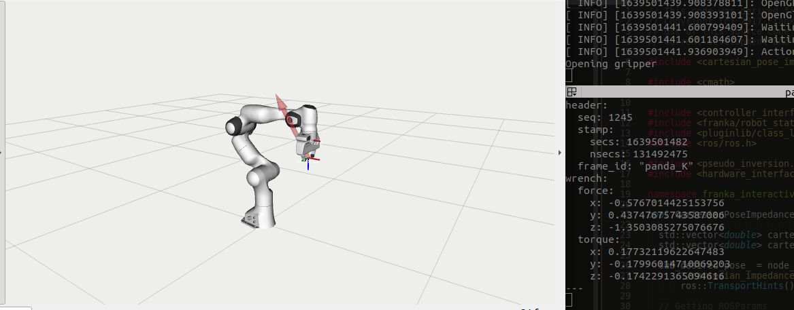
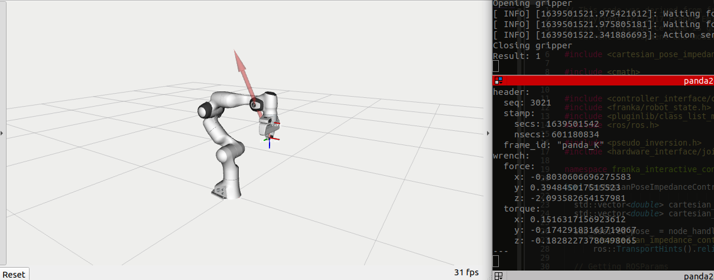

# External tool compensation instructions

Whenever external tools are mounted on the franka hand, we need to compensate for these additional external forces in order to properly control the robot in the following modes:
- gravity compensation
- joint impedance
- cartesian impedance

When doing direct position or velocity control with the internal franka controllers, this might not be necessary, yet the motors will be making extra effort than what the task requires. So it is always recommended to compensate for this weight, either in code like in this package or by changing the tool parameters in the DESK application.

**Thankfully,**  the gravity compesnation, joint and cartesian impedance controllers implemented in this package already include the code for compensating for these external forces.  

**USAGE:** All you need to do is fill in ``external_tool_compensation: [f_x, f_y, f_z,tau_x,tau_y,tau_z]`` for your specific external tool/s in the [./config/impedance_control_additional_params.yaml](https://github.com/nbfigueroa/franka_interactive_controllers/blob/main/config/impedance_control_additional_params.yaml)

To get these values for your tool, follow the steps below (normally with ``[f_x, f_y, f_z,0,0,0]`` should work):

1. Move the robot to the ``home`` joint configuration (end-effector parallel to the table plane), this can be done by running the following node:
```bash
rosrun franka_interactive_controllers libfranka_joint_goal_motion_generator 1
```
The robot should go to this position:  
IMAGE HERE

2. Bringup franka_control by launching the main robot launch file:
```bash
roslaunch franka_interactive_controllers franka_interactive_bringup.launch
```

If you active the WrenchStamped in rviz you will see the measured force on the end-effector computed by the measured joint torques of the robot. 
You should see these values by echoing the ``F_ext`` topic:
```bash
rostopic echo /franka_state_controller/F_ext
```
This is the topic being displayed in the terminal below:
  <p align="center">
     
  </p>


3. Depending on the tool, mount it and close the gripper fingers (gui for gripper control pops up with launch file, if it doesn't you're doing something wrong). For the scoop tool this is how it should look like:
IMAGE HERE

4. Measure the external forces again (Repeat Step 2):
  <p align="center">
     
  </p>

5. Now you have ``F_ext`` before and after mounting the tool, take the difference F_ext^{tool} = (F_ext^{with tool} - F_ext^{no tool}) and fill in the value in [./config/impedance_control_additional_params.yaml](https://github.com/nbfigueroa/franka_interactive_controllers/blob/main/config/impedance_control_additional_params.yaml).

6. To verify calibration is correct you can run the joint gravity compensation controller as follows:
```bash
roslaunch franka_interactive_controllers joint_gravity_compensation_controller.launch
```
This assumes ``franka_interactive_bringup.launch`` is loaded in another terminal, otherwise set ``load_franka_control:=true``.


  <p align="center">
     
  </p>

- If the robot does not move and you can physically guide it and it does not move by itself then calibration works. If you move the robot and it keeps moving when you release it you might need to add force values in some directions and this requires a more systematic calibration scheme. However, it should be too difficult to find the correct values. 

- You can also untick the ``activate_tool_compensation`` to see how the robot behaves without these compensation forces. If there is no external tool, the robot will not move, but if there is the robot should fall downwards. 

