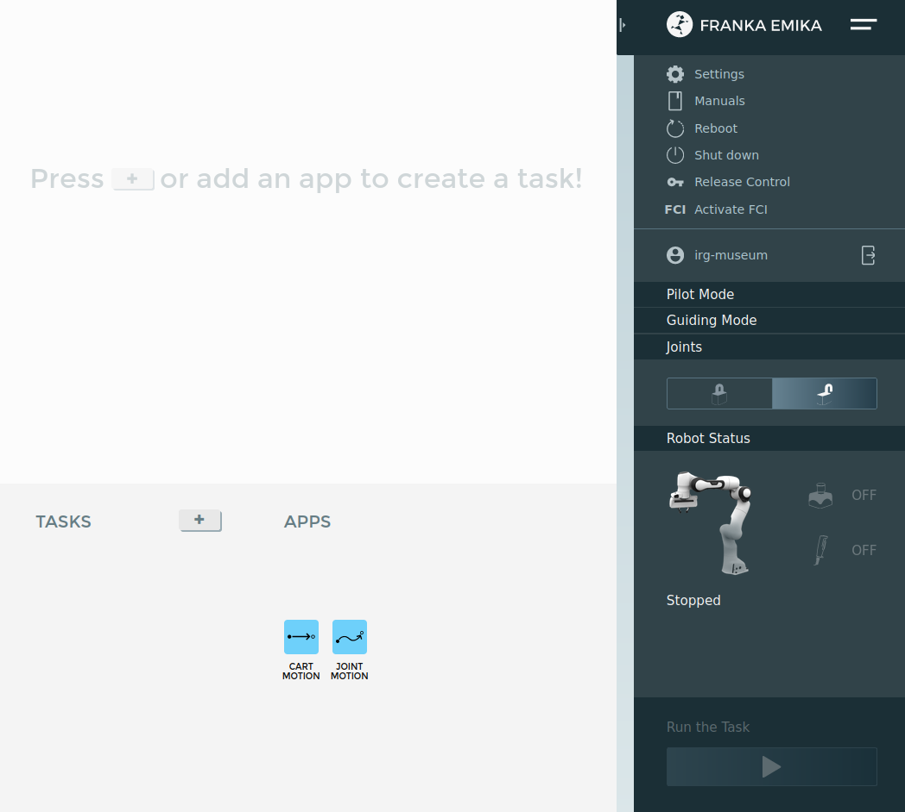
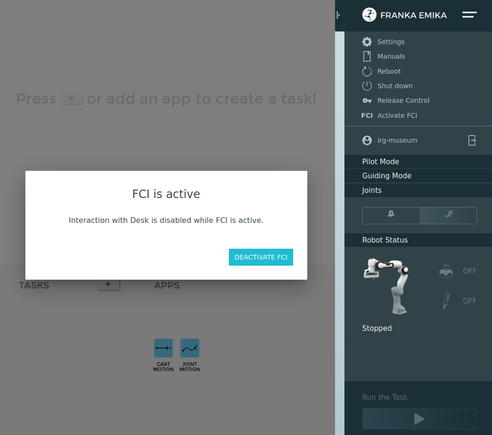

# Startup the robot

1. Turn on the robot.
2. Login to: https://172.16.0.2/desk/
3. Unlock joints:
  

     
  

4. Activate FCI:
  

     
  

5. Run the [franka_interactive_bringup.launch](https://github.com/nbfigueroa/franka_interactive_controllers/blob/main/launch/franka_interactive_bringup.launch) file or any of the other controller launch files, see main [README](https://github.com/nbfigueroa/franka_interactive_controllers/blob/main/README.md) file. 
