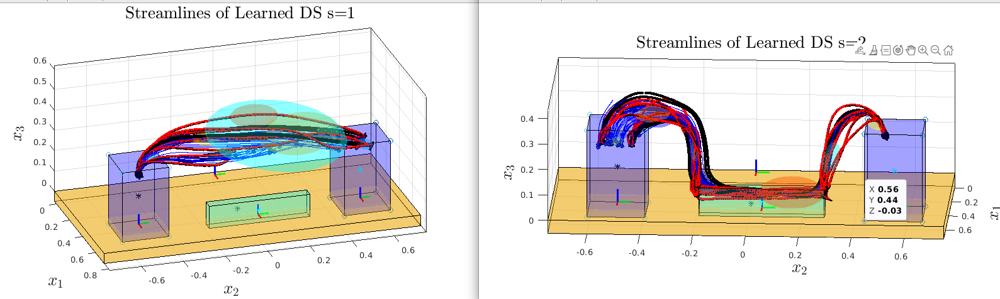

# Instructions for MIT Museum Inspection Demo

First follow [robot_startup](https://github.com/nbfigueroa/franka_interactive_controllers/blob/main/doc/instructions/robot_startup.md) as per usual to startup the robot FCI control. Then you have **2 DEMO OPTIONS**:

 a. **Learning+Execution:** Learn new models from trajectories kinesthetically demonstrated by museum goer and execute those learned models with interactive perturbation capabilities (for this demo you need to run instructions for Phase 1 and 2 below)  
 b. **Execution:** Run pre-learned optimal models and execute them with interactive perturbation capabilities (for this demo you only need to follow intrusctions Phase 2 below)

### Phase 1. Learning New Motion Policy Models from Kinesthetic Demonstrations (~4min to complete)

1. To record demonstrations you can run the gravity compensation controller (in another terminal):
```
$ roslaunch franka_interactive_controllers joint_gravity_compensation_controller.launch
```

### Phase 2. Running the Interactive Execution of Pre-Learned Models

#### On Primary Control PC w/Real-TIME Kernel (interactive2)
1. Before starting execution of the task send robot to home joint position (franka_control_interactive.launch should NOT BE running -- make sure robot is not near a collision before running this! You can move the robot manually first):
   ```bash
   rosrun franka_interactive_controllers libfranka_joint_goal_motion_generator_mit 1
   ```
2. Bringup the franka interactive control interface with museum configure rviz (in one terminal):
   ```bash
   roslaunch franka_interactive_controllers franka_museum_interactive_bringup.launch
   ```

3. Load the passive_ds_controller that will receive velocities from the learned DS motion policies and convert them to control torques:
   ```bash
   roslaunch franka_interactive_controllers passive_ds_impedance_controller.launch
   ```
 **NOTE**: 2 and 3 can be merge to same launch file once pipeline is robust.


#### The following can run on Primary (interactive2) or Secondary (interactive) Control PC 

#### On Primary Control PC (interactive2)

### 1. Bringup visualization (in one terminal):
```
$ roslaunch franka_interactive_controllers franka_interactive_bringup.launch
```

### 2. To execute a learned motion policy load franka-lpvds tasks (in one terminal):

#### To run the PICKING DS, run the following:
```
$ roslaunch ds_motion_generator franka_inspection_museum_lpvDS_motionGenerator.launch ds_num:=1_left
```
This will run DS1 (pick block) with target 1. Targets denoted on box. Options are:
- 1_left:  left-most picking location (person view)
- 1_right: right-most pickig location

#### To run the INSPECTION-RELEASE DS, run the following:
```
$ roslaunch ds_motion_generator franka_inspection_museum_lpvDS_motionGenerator.launch ds_num:=2
```

### 3. On this PC you can show the learned trajectories from MATLAB:
- Open MATLAB in terminal write the following:
```
$ run_matlab
```
Navigate to: `` /home/nadiafig/code/auto-ds-learning/figs``
Open the files: ``franka-inspection-ds1.fig`` and ``franka-inspection-ds2.fig``

You should see this:
 <p align="center">
       
  </p>

### 4. On this PC you can also show videos of the demonstrations, trajecories and execution:
All are in this folder: ``/home/nadiafig/Desktop/videos-icra-demo ``

### Alternative [extra demo]: If you want to record demos then you can run the following and click "record" in the pop-up GUI:
```
$ roslaunch franka_interactive_controllers franka_kinesthetic_teaching.launch
```

